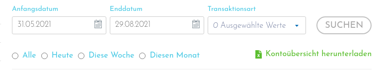

# Portfolio CSV Converter
Konvertiert Excel und CSV Dateien in das für den CSV Import von Portfolio 
Performance notwendige format.

## Verwendung

``` python
python3 PpCsvConverter.py -i[nputfile] <DateiMitPfad> -f[ormat] <EingabeFormat>
```
Die fertig konvertierte Datei wird in dasselbe Verzeichnis gespeichert wie die Originaldatei. Sie 
bekommt nur die Erweiterung *_convert.csv*
## Unterstützte Importformate
### VIAInvest 
Exceldatei die über ***Kontoübersicht herunterladen*** lokal gespeichert werden kann. Aktuell erfolgt eine 
Unterscheidung nach Zinszahlung und Einzahlung.

Auszahlungen sind **nicht** umgesetzt und werden somit auch nicht mit in die konvertierte Datei übertragen.

### Bondora Portfolio Manager
Exceldatei die über die Berichtfunktion ***Kontoauszug*** heruntergeladen werden kann.
Umbuchungen auf das Go&Grow werden erkannt. Die Zinsen aus Go&Grow können über den PDF-Import - direkt in PP - 
importiert werden.

Auszahlungen sind **nicht** umgesetzt und werden somit auch nicht mit in die konvertierte Datei übertragen.